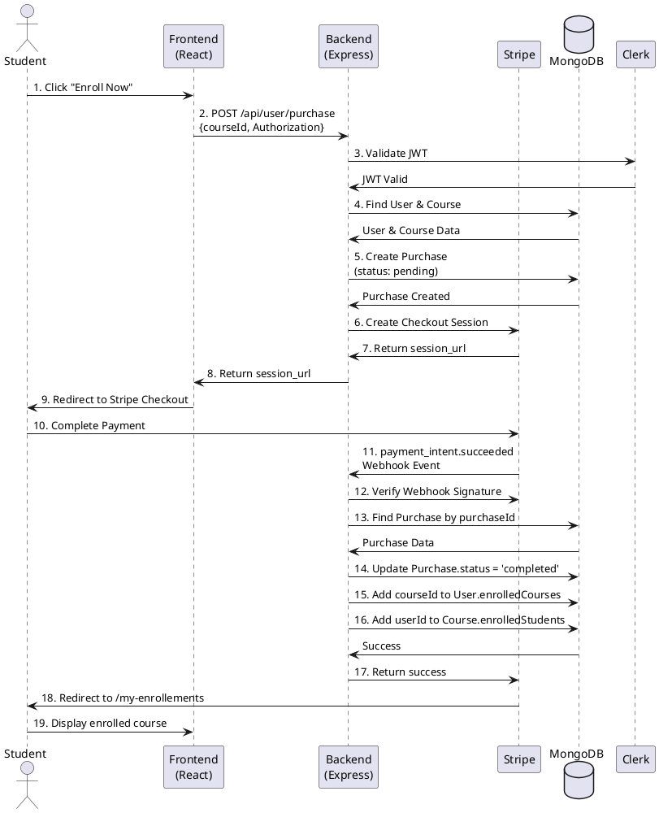
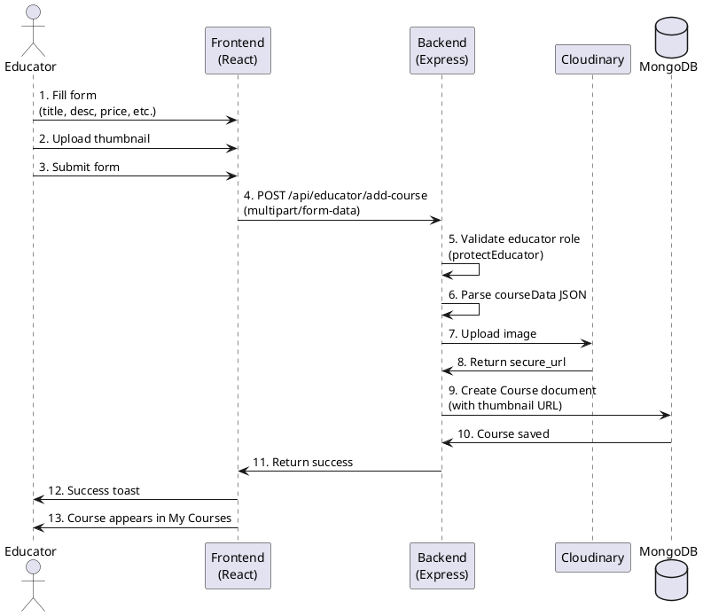
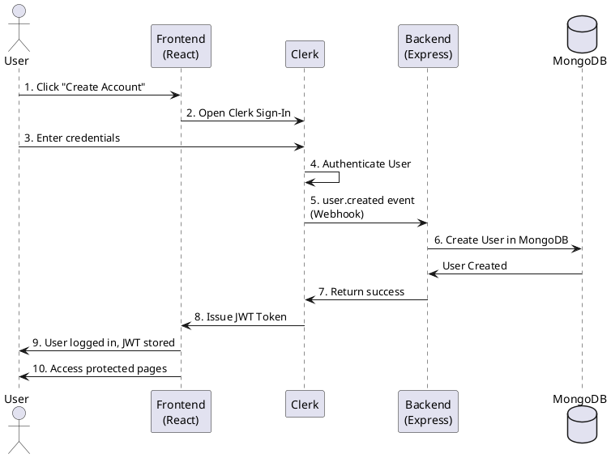
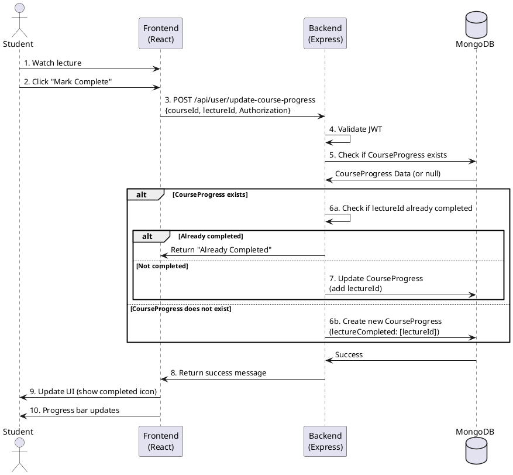
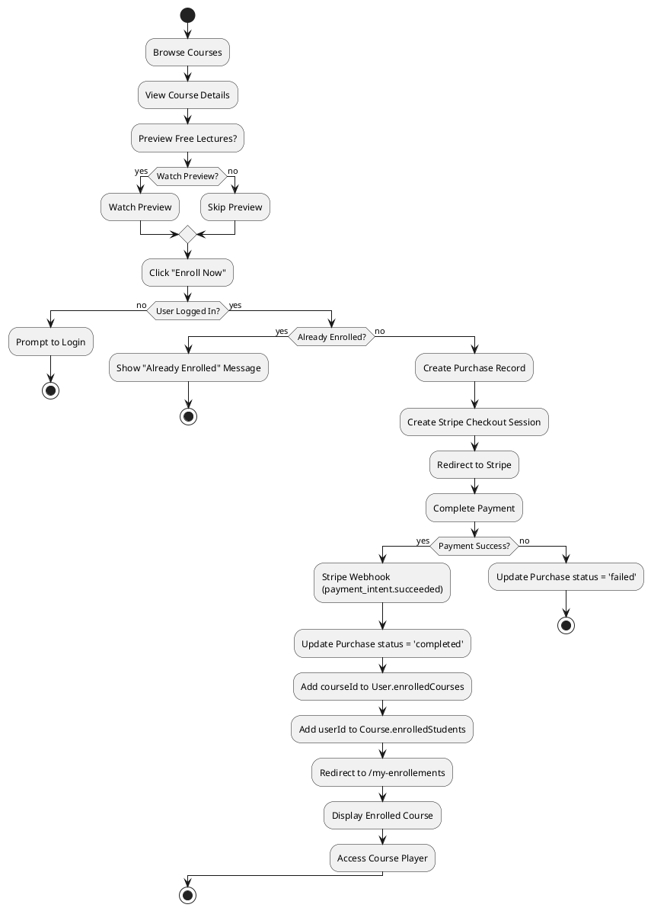
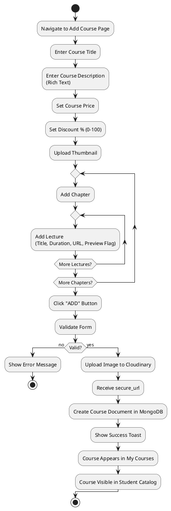
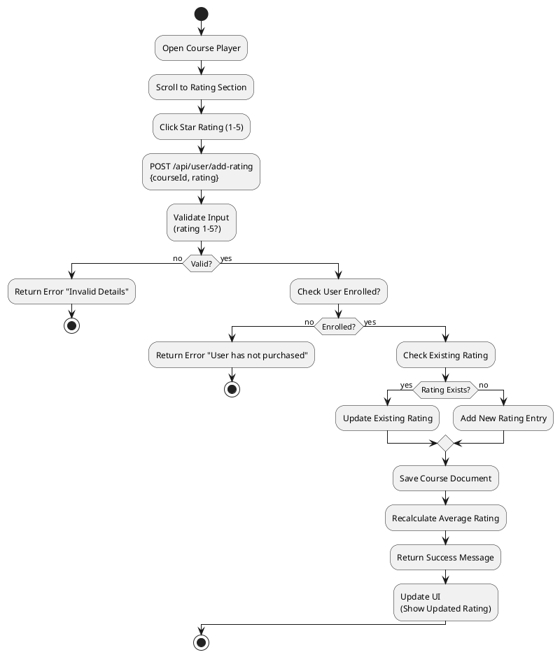
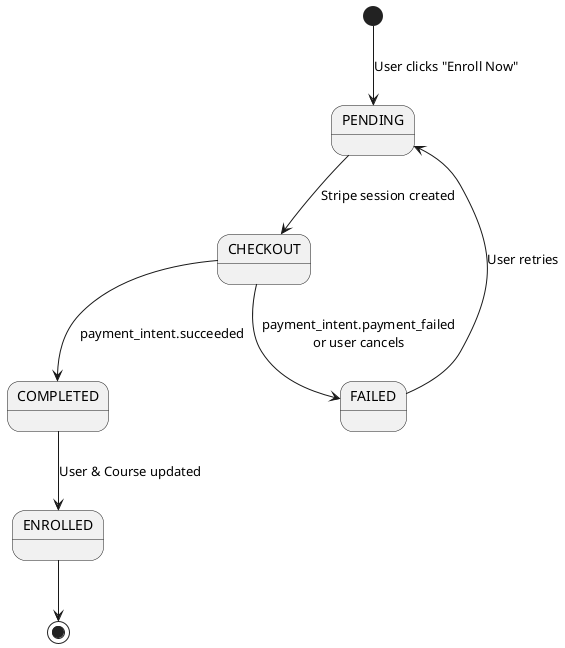
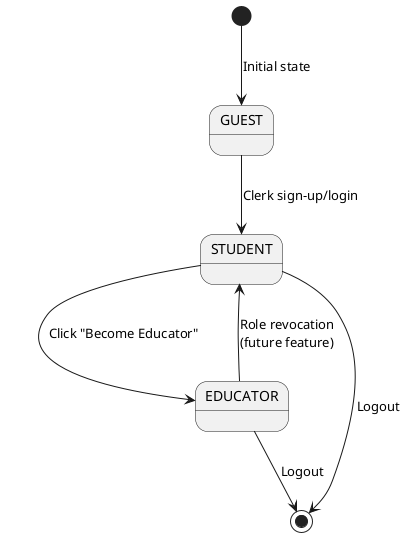
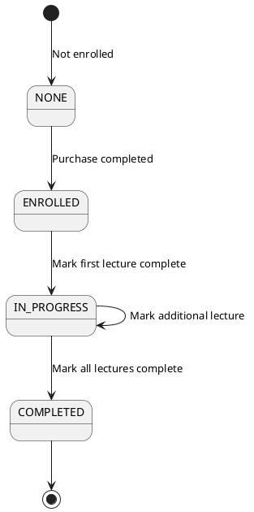

# 3. Behavioural Design – LMS Website

This document presents sequence diagrams, activity diagrams, and state machine diagrams for key workflows in the LMS system.

---

## 3.1 Sequence Diagrams

### 3.1.1 Course Purchase and Enrollment Sequence Diagram

**Scenario**: Student purchases a course and gets enrolled after successful payment.

```
┌──────────┐    ┌──────────┐    ┌──────────┐    ┌──────────┐    ┌──────────┐    ┌──────────┐
│ Student  │    │ Frontend │    │ Backend  │    │ Stripe   │    │ MongoDB  │    │ Clerk    │
│ Browser  │    │ (React)  │    │ (Express)│    │          │    │          │    │          │
└────┬─────┘    └────┬─────┘    └────┬─────┘    └────┬─────┘    └────┬─────┘    └────┬─────┘
     │                │                │                │                │                │
     │ 1. Click       │                │                │                │                │
     │ "Enroll Now"   │                │                │                │                │
     ├───────────────>│                │                │                │                │
     │                │                │                │                │                │
     │                │ 2. POST /api/user/purchase      │                │                │
     │                │    {courseId, Authorization}     │                │                │
     │                ├────────────────────────────────>│                │                │
     │                │                │                │                │                │
     │                │                │ 3. Validate JWT│                │                │
     │                │                ├─────────────────────────────────────────────────>│
     │                │                │<─────────────────────────────────────────────────┤
     │                │                │                │                │                │
     │                │                │ 4. Find User & Course                           │
     │                │                ├─────────────────────────────────────────────────>│
     │                │                │<─────────────────────────────────────────────────┤
     │                │                │                │                │                │
     │                │                │ 5. Create Purchase (status: pending)            │
     │                │                ├─────────────────────────────────────────────────>│
     │                │                │<─────────────────────────────────────────────────┤
     │                │                │                │                │                │
     │                │                │ 6. Create Stripe Checkout Session              │
     │                │                ├─────────────────────────────────────────────────>│
     │                │                │                │ 7. Return session_url        │
     │                │                │<─────────────────────────────────────────────────┤
     │                │                │                │                │                │
     │                │ 8. Return session_url            │                │                │
     │                │<─────────────────────────────────┤                │                │
     │                │                │                │                │                │
     │ 9. Redirect to Stripe Checkout                   │                │                │
     │<──────────────────────────────────────────────────┤                │                │
     │                │                │                │                │                │
     │ 10. Complete Payment                             │                │                │
     ├───────────────────────────────────────────────────────────────────────────────────>│
     │                │                │                │                │                │
     │                │                │                │ 11. payment_intent.succeeded   │
     │                │                │                │    Webhook Event               │
     │                │                │<─────────────────────────────────────────────────┤
     │                │                │                │                │                │
     │                │                │ 12. Verify Webhook Signature                     │
     │                │                ├─────────────────────────────────────────────────>│
     │                │                │                │                │                │
     │                │                │ 13. Find Purchase by purchaseId                  │
     │                │                ├─────────────────────────────────────────────────>│
     │                │                │<─────────────────────────────────────────────────┤
     │                │                │                │                │                │
     │                │                │ 14. Update Purchase.status = 'completed'        │
     │                │                ├─────────────────────────────────────────────────>│
     │                │                │                │                │                │
     │                │                │ 15. Add courseId to User.enrolledCourses        │
     │                │                ├─────────────────────────────────────────────────>│
     │                │                │                │                │                │
     │                │                │ 16. Add userId to Course.enrolledStudents        │
     │                │                ├─────────────────────────────────────────────────>│
     │                │                │                │                │                │
     │                │                │ 17. Return success                              │
     │                │                │<─────────────────────────────────────────────────┤
     │                │                │                │                │                │
     │ 18. Redirect to /my-enrollements                 │                │                │
     │<──────────────────────────────────────────────────┤                │                │
     │                │                │                │                │                │
     │ 19. Display enrolled course                      │                │                │
     │<──────────────────────────────────────────────────┤                │                │
```

**PlantUML Syntax** (for rendering):


---

### 3.1.2 Course Creation Sequence Diagram

**Scenario**: Educator creates a new course with thumbnail, chapters, and lectures.

```
┌──────────┐    ┌──────────┐    ┌──────────┐    ┌──────────┐    ┌──────────┐
│Educator │    │ Frontend │    │ Backend  │    │Cloudinary│    │ MongoDB  │
│ Browser │    │ (React)  │    │ (Express)│    │          │    │          │
└────┬────┘    └────┬─────┘    └────┬─────┘    └────┬─────┘    └────┬─────┘
     │               │                │                │                │
     │ 1. Fill form  │                │                │                │
     │ (title, desc, │                │                │                │
     │  price, etc.) │                │                │                │
     ├──────────────>│                │                │                │
     │               │                │                │                │
     │ 2. Upload     │                │                │                │
     │ thumbnail     │                │                │                │
     ├──────────────>│                │                │                │
     │               │                │                │                │
     │ 3. Submit form│                │                │                │
     ├──────────────>│                │                │                │
     │               │                │                │                │
     │               │ 4. POST /api/educator/add-course│                │
     │               │    (multipart/form-data)         │                │
     │               ├─────────────────────────────────>│                │
     │               │                │                │                │
     │               │                │ 5. Validate educator role       │
     │               │                │    (protectEducator middleware)  │
     │               │                │                │                │
     │               │                │ 6. Parse courseData JSON        │
     │               │                │                │                │
     │               │                │ 7. Upload image to Cloudinary   │
     │               │                ├─────────────────────────────────>│
     │               │                │                │ 8. Return secure_url
     │               │                │<─────────────────────────────────┤
     │               │                │                │                │
     │               │                │ 9. Create Course document       │
     │               │                │    (with thumbnail URL)         │
     │               │                ├─────────────────────────────────────────────────>│
     │               │                │                │                │ 10. Course saved
     │               │                │<────────────────────────────────────────────────────┤
     │               │                │                │                │
     │               │ 11. Return success              │                │                │
     │               │<─────────────────────────────────┤                │                │
     │               │                │                │                │
     │ 12. Success toast               │                │                │                │
     │<─────────────────────────────────────────────────┤                │                │
     │               │                │                │                │
     │ 13. Course appears in My Courses│                │                │                │
     │<─────────────────────────────────────────────────┤                │                │
```

**PlantUML Syntax**:


---

### 3.1.3 User Authentication Sequence Diagram

**Scenario**: User registers/logs in via Clerk and gets synced to MongoDB.

```
┌──────────┐    ┌──────────┐    ┌──────────┐    ┌──────────┐    ┌──────────┐
│  User   │    │ Frontend │    │  Clerk   │    │ Backend  │    │ MongoDB  │
│ Browser │    │ (React)  │    │          │    │ (Express)│    │          │
└────┬────┘    └────┬─────┘    └────┬─────┘    └────┬─────┘    └────┬─────┘
     │               │                │                │                │
     │ 1. Click      │                │                │                │
     │ "Create       │                │                │                │
     │  Account"     │                │                │                │
     ├──────────────>│                │                │                │
     │               │                │                │                │
     │               │ 2. Open Clerk Sign-In           │                │
     │               ├────────────────────────────────>│                │
     │               │                │                │                │
     │ 3. Enter credentials                            │                │
     ├─────────────────────────────────────────────────>│                │
     │               │                │                │                │
     │               │                │ 4. Authenticate User            │
     │               │                │                │                │
     │               │                │ 5. user.created event           │
     │               │                ├─────────────────────────────────>│
     │               │                │                │                │
     │               │                │                │ 6. Create User  │
     │               │                │                │    in MongoDB  │
     │               │                │                ├────────────────>│
     │               │                │                │<────────────────┤
     │               │                │                │                │
     │               │                │ 7. Return success               │
     │               │                │<─────────────────────────────────┤
     │               │                │                │                │
     │               │ 8. Issue JWT Token              │                │
     │               │<─────────────────────────────────┤                │
     │               │                │                │                │
     │ 9. User logged in, JWT stored                   │                │
     │<─────────────────────────────────────────────────┤                │
     │               │                │                │                │
     │ 10. Access protected pages                       │                │
     │<─────────────────────────────────────────────────┤                │
```

**PlantUML Syntax**:


---

### 3.1.4 Mark Lecture Complete Sequence Diagram

**Scenario**: Student marks a lecture as completed and progress is updated.

```
┌──────────┐    ┌──────────┐    ┌──────────┐    ┌──────────┐
│ Student │    │ Frontend │    │ Backend  │    │ MongoDB  │
│ Browser │    │ (React)  │    │ (Express)│    │          │
└────┬─────┘    └────┬─────┘    └────┬─────┘    └────┬─────┘
     │                │                │                │
     │ 1. Watch       │                │                │
     │ lecture        │                │                │
     ├───────────────>│                │                │
     │                │                │                │
     │ 2. Click       │                │                │
     │ "Mark Complete"│                │                │
     ├───────────────>│                │                │
     │                │                │                │
     │                │ 3. POST /api/user/update-course-progress│
     │                │    {courseId, lectureId, Authorization}   │
     │                ├──────────────────────────────────────────>│
     │                │                │                │
     │                │                │ 4. Validate JWT│
     │                │                │                │
     │                │                │ 5. Check if CourseProgress exists│
     │                │                ├──────────────────────────────────>│
     │                │                │<──────────────────────────────────┤
     │                │                │                │
     │                │                │ 6a. If exists: Check if lectureId│
     │                │                │      already in lectureCompleted │
     │                │                │                │
     │                │                │ 6b. If not exists: Create new    │
     │                │                │      CourseProgress              │
     │                │                ├──────────────────────────────────>│
     │                │                │                │
     │                │                │ 7. Update/Create CourseProgress │
     │                │                │    (add lectureId to array)      │
     │                │                ├──────────────────────────────────>│
     │                │                │<──────────────────────────────────┤
     │                │                │                │
     │                │ 8. Return success message        │                │
     │                │<─────────────────────────────────┤                │
     │                │                │                │
     │ 9. Update UI (show completed icon)               │                │
     │<──────────────────────────────────────────────────┤                │
     │                │                │                │
     │ 10. Progress bar updates                         │                │
     │<──────────────────────────────────────────────────┤                │
```

**PlantUML Syntax**:


---

## 3.2 Activity Diagrams

### 3.2.1 Student Enrollment Process Activity Diagram

**Description**: Complete flow from browsing courses to being enrolled and accessing content.

```
┌─────────────────────────────────────────────────────────────┐
│              Student Enrollment Process                      │
└─────────────────────────────────────────────────────────────┘
                              │
                              ▼
                    ┌─────────────────┐
                    │ Browse Courses  │
                    └────────┬────────┘
                             │
                             ▼
                    ┌─────────────────┐
                    │ View Course     │
                    │ Details         │
                    └────────┬────────┘
                             │
                             ▼
                    ┌─────────────────┐
                    │ Preview Free    │
                    │ Lectures?       │
                    └────────┬────────┘
                             │
                    ┌────────┴────────┐
                    │                 │
                    ▼                 ▼
            ┌──────────────┐  ┌──────────────┐
            │ Watch Preview│  │ Skip Preview │
            └──────┬───────┘  └──────┬───────┘
                    │                 │
                    └────────┬────────┘
                             │
                             ▼
                    ┌─────────────────┐
                    │ Click "Enroll   │
                    │ Now"            │
                    └────────┬────────┘
                             │
                             ▼
                    ┌─────────────────┐
                    │ User Logged In?  │
                    └────────┬────────┘
                             │
                    ┌────────┴────────┐
                    │                 │
                    ▼                 ▼
            ┌──────────────┐  ┌──────────────┐
            │ Already       │  │ Prompt to    │
            │ Enrolled?     │  │ Login        │
            └──────┬───────┘  └──────┬───────┘
                    │                 │
            ┌───────┴───────┐         │
            │               │         │
            ▼               ▼         │
    ┌──────────────┐  ┌──────────────┐│
    │ Show "Already│  │ Create       ││
    │ Enrolled"    │  │ Purchase     ││
    │ Message      │  │ Record       ││
    └──────────────┘  └──────┬───────┘│
                              │        │
                              └────────┘
                              │
                              ▼
                    ┌─────────────────┐
                    │ Create Stripe   │
                    │ Checkout        │
                    │ Session         │
                    └────────┬────────┘
                             │
                             ▼
                    ┌─────────────────┐
                    │ Redirect to     │
                    │ Stripe          │
                    └────────┬────────┘
                             │
                             ▼
                    ┌─────────────────┐
                    │ Complete Payment│
                    └────────┬────────┘
                             │
                    ┌────────┴────────┐
                    │                 │
                    ▼                 ▼
            ┌──────────────┐  ┌──────────────┐
            │ Payment      │  │ Payment      │
            │ Success      │  │ Failed       │
            └──────┬───────┘  └──────┬───────┘
                    │                 │
                    │                 ▼
                    │         ┌──────────────┐
                    │         │ Update       │
                    │         │ Purchase     │
                    │         │ status =     │
                    │         │ 'failed'     │
                    │         └──────────────┘
                    │
                    ▼
            ┌─────────────────┐
            │ Stripe Webhook   │
            │ (payment_intent. │
            │ succeeded)       │
            └────────┬─────────┘
                     │
                     ▼
            ┌─────────────────┐
            │ Update Purchase │
            │ status =        │
            │ 'completed'     │
            └────────┬─────────┘
                     │
                     ▼
            ┌─────────────────┐
            │ Add courseId to  │
            │ User.enrolled    │
            │ Courses          │
            └────────┬─────────┘
                     │
                     ▼
            ┌─────────────────┐
            │ Add userId to    │
            │ Course.enrolled │
            │ Students         │
            └────────┬─────────┘
                     │
                     ▼
            ┌─────────────────┐
            │ Redirect to      │
            │ /my-enrollements │
            └────────┬─────────┘
                     │
                     ▼
            ┌─────────────────┐
            │ Display Enrolled │
            │ Course           │
            └────────┬─────────┘
                     │
                     ▼
            ┌─────────────────┐
            │ Access Course    │
            │ Player           │
            └──────────────────┘
```

**PlantUML Syntax**:


---

### 3.2.2 Educator Course Creation Process Activity Diagram

**Description**: Flow for creating and publishing a course.

```
┌─────────────────────────────────────────────────────────────┐
│          Educator Course Creation Process                    │
└─────────────────────────────────────────────────────────────┘
                              │
                              ▼
                    ┌─────────────────┐
                    │ Navigate to     │
                    │ Add Course Page │
                    └────────┬────────┘
                             │
                             ▼
                    ┌─────────────────┐
                    │ Enter Course    │
                    │ Title           │
                    └────────┬────────┘
                             │
                             ▼
                    ┌─────────────────┐
                    │ Enter Course    │
                    │ Description     │
                    │ (Rich Text)     │
                    └────────┬────────┘
                             │
                             ▼
                    ┌─────────────────┐
                    │ Set Course      │
                    │ Price           │
                    └────────┬────────┘
                             │
                             ▼
                    ┌─────────────────┐
                    │ Set Discount %  │
                    │ (0-100)         │
                    └────────┬────────┘
                             │
                             ▼
                    ┌─────────────────┐
                    │ Upload          │
                    │ Thumbnail       │
                    └────────┬────────┘
                             │
                             ▼
                    ┌─────────────────┐
                    │ Add Chapters    │
                    │ (Repeat)        │
                    └────────┬────────┘
                             │
                             ▼
                    ┌─────────────────┐
                    │ For Each Chapter│
                    │ Add Lectures    │
                    │ (Repeat)        │
                    └────────┬────────┘
                             │
                             ▼
                    ┌─────────────────┐
                    │ For Each Lecture│
                    │ - Title         │
                    │ - Duration      │
                    │ - URL           │
                    │ - Preview Flag  │
                    └────────┬────────┘
                             │
                             ▼
                    ┌─────────────────┐
                    │ Click "ADD"     │
                    │ Button          │
                    └────────┬────────┘
                             │
                             ▼
                    ┌─────────────────┐
                    │ Validate Form   │
                    └────────┬────────┘
                             │
                    ┌────────┴────────┐
                    │                 │
                    ▼                 ▼
            ┌──────────────┐  ┌──────────────┐
            │ Valid?       │  │ Show Error   │
            │              │  │ Message      │
            └──────┬───────┘  └──────────────┘
                    │
                    ▼
            ┌─────────────────┐
            │ Upload Image to  │
            │ Cloudinary       │
            └────────┬─────────┘
                     │
                     ▼
            ┌─────────────────┐
            │ Receive         │
            │ secure_url      │
            └────────┬─────────┘
                     │
                     ▼
            ┌─────────────────┐
            │ Create Course    │
            │ Document in      │
            │ MongoDB          │
            └────────┬─────────┘
                     │
                     ▼
            ┌─────────────────┐
            │ Show Success    │
            │ Toast           │
            └────────┬─────────┘
                     │
                     ▼
            ┌─────────────────┐
            │ Course Appears  │
            │ in My Courses   │
            └────────┬─────────┘
                     │
                     ▼
            ┌─────────────────┐
            │ Course Visible  │
            │ in Student      │
            │ Catalog         │
            └──────────────────┘
```

**PlantUML Syntax**:


---

### 3.2.3 Course Rating Process Activity Diagram

**Description**: Student rates an enrolled course.

```
┌─────────────────────────────────────────────────────────────┐
│              Course Rating Process                           │
└─────────────────────────────────────────────────────────────┘
                              │
                              ▼
                    ┌─────────────────┐
                    │ Open Course     │
                    │ Player          │
                    └────────┬────────┘
                             │
                             ▼
                    ┌─────────────────┐
                    │ Scroll to       │
                    │ Rating Section  │
                    └────────┬────────┘
                             │
                             ▼
                    ┌─────────────────┐
                    │ Click Star      │
                    │ Rating (1-5)    │
                    └────────┬────────┘
                             │
                             ▼
                    ┌─────────────────┐
                    │ POST /api/user/ │
                    │ add-rating      │
                    │ {courseId,      │
                    │  rating}        │
                    └────────┬────────┘
                             │
                             ▼
                    ┌─────────────────┐
                    │ Validate Input   │
                    │ (rating 1-5?)   │
                    └────────┬────────┘
                             │
                    ┌────────┴────────┐
                    │                 │
                    ▼                 ▼
            ┌──────────────┐  ┌──────────────┐
            │ Valid        │  │ Return Error │
            │              │  │ "Invalid     │
            └──────┬───────┘  │ Details"     │
                   │          └──────────────┘
                   │
                   ▼
            ┌─────────────────┐
            │ Check User      │
            │ Enrolled?       │
            └────────┬────────┘
                     │
            ┌────────┴────────┐
            │                 │
            ▼                 ▼
    ┌──────────────┐  ┌──────────────┐
    │ Enrolled     │  │ Return Error │
    │              │  │ "User has not│
    └──────┬───────┘  │ purchased"   │
           │          └──────────────┘
           │
           ▼
    ┌─────────────────┐
    │ Check Existing  │
    │ Rating          │
    └────────┬────────┘
             │
    ┌────────┴────────┐
    │                 │
    ▼                 ▼
┌──────────────┐  ┌──────────────┐
│ Rating       │  │ Add New      │
│ Exists?      │  │ Rating Entry │
│              │  │              │
│ Update       │  │              │
│ Existing     │  │              │
│ Rating       │  │              │
└──────┬───────┘  └──────┬───────┘
       │                 │
       └────────┬────────┘
                │
                ▼
        ┌─────────────────┐
        │ Save Course     │
        │ Document        │
        └────────┬────────┘
                 │
                 ▼
        ┌─────────────────┐
        │ Recalculate    │
        │ Average Rating  │
        └────────┬────────┘
                 │
                 ▼
        ┌─────────────────┐
        │ Return Success  │
        │ Message         │
        └────────┬────────┘
                 │
                 ▼
        ┌─────────────────┐
        │ Update UI       │
        │ (Show Updated   │
        │ Rating)         │
        └──────────────────┘
```

**PlantUML Syntax**:


---

## 3.3 State Machine Diagrams

### 3.3.1 Purchase/Payment State Machine

**Description**: States and transitions for a course purchase transaction.

```
┌─────────────────────────────────────────────────────────────┐
│              Purchase/Payment State Machine                  │
└─────────────────────────────────────────────────────────────┘

                    ┌──────────────┐
                    │   [Initial]  │
                    └──────┬───────┘
                           │
                           │ User clicks "Enroll Now"
                           ▼
                    ┌──────────────┐
                    │   PENDING    │◄──────────┐
                    │  (Purchase   │           │
                    │   created)   │           │
                    └──────┬───────┘           │
                           │                   │
                           │ Stripe session    │
                           │ created           │
                           ▼                   │
                    ┌──────────────┐           │
                    │  CHECKOUT    │           │
                    │  (Redirected │           │
                    │   to Stripe) │           │
                    └──────┬───────┘           │
                           │                   │
                    ┌──────┴───────┐           │
                    │               │           │
                    ▼               ▼           │
            ┌──────────────┐  ┌──────────────┐ │
            │  COMPLETED   │  │   FAILED     │ │
            │  (Payment    │  │  (Payment    │ │
            │   success    │  │   failed or  │ │
            │   webhook)   │  │   cancelled) │ │
            └──────────────┘  └──────────────┘ │
                    │                   │       │
                    │                   │       │
                    │                   └───────┘
                    │                   (Retry possible)
                    │
                    ▼
            ┌──────────────┐
            │  ENROLLED    │
            │  (User added │
            │   to course) │
            └──────────────┘
```

**State Transitions**:
- **Initial → PENDING**: User clicks "Enroll Now", Purchase document created with `status: 'pending'`
- **PENDING → CHECKOUT**: Stripe Checkout session created, user redirected
- **CHECKOUT → COMPLETED**: Stripe webhook `payment_intent.succeeded` received
- **CHECKOUT → FAILED**: Stripe webhook `payment_intent.payment_failed` received or user cancels
- **FAILED → PENDING**: User retries purchase (new Purchase document created)
- **COMPLETED → ENROLLED**: Backend updates User and Course documents

**PlantUML Syntax**:


---

### 3.3.2 Course Publication State Machine

**Description**: States for course visibility and publication status.

```
┌─────────────────────────────────────────────────────────────┐
│           Course Publication State Machine                    │
└─────────────────────────────────────────────────────────────┘

                    ┌──────────────┐
                    │   [DRAFT]    │
                    │  (Course     │
                    │   created,   │
                    │   not saved) │
                    └──────┬───────┘
                           │
                           │ Educator saves course
                           ▼
                    ┌──────────────┐
                    │   CREATED    │
                    │  (isPublished│
                    │   = true by  │
                    │   default)   │
                    └──────┬───────┘
                           │
                    ┌──────┴───────┐
                    │               │
                    ▼               ▼
            ┌──────────────┐  ┌──────────────┐
            │  PUBLISHED   │  │  UNPUBLISHED  │
            │  (Visible in │  │  (Not visible│
            │   catalog)   │  │   to students)│
            └──────┬───────┘  └──────┬───────┘
                   │                 │
                   │                 │
                   └────────┬────────┘
                            │
                            │ (Future: Toggle)
                            ▼
                    ┌──────────────┐
                    │   ARCHIVED   │
                    │  (Course no  │
                    │   longer     │
                    │   available) │
                    └──────────────┘
```

**State Transitions**:
- **DRAFT → CREATED**: Course saved to database (`isPublished: true` by default)
- **CREATED → PUBLISHED**: Course appears in student catalog (current implementation)
- **CREATED → UNPUBLISHED**: If `isPublished: false` (not currently implemented in UI)
- **PUBLISHED ↔ UNPUBLISHED**: Toggle publication status (future feature)
- **PUBLISHED/UNPUBLISHED → ARCHIVED**: Course archived/deleted (future feature)

**Note**: Current implementation sets `isPublished: true` by default and doesn't provide UI to unpublish. This state machine represents an improved design.

**PlantUML Syntax**:
```plantuml
@startuml CoursePublicationStateMachine
[*] --> DRAFT : Educator starts creating
DRAFT --> CREATED : Course saved\n(isPublished: true)
CREATED --> PUBLISHED : Course visible in catalog
CREATED --> UNPUBLISHED : isPublished: false\n(not in UI yet)
PUBLISHED <--> UNPUBLISHED : Toggle publication\n(future feature)
PUBLISHED --> ARCHIVED : Archive course\n(future feature)
UNPUBLISHED --> ARCHIVED : Archive course\n(future feature)
ARCHIVED --> [*]
@enduml
```

---

### 3.3.3 User Role State Machine

**Description**: User role transitions (Student ↔ Educator).

```
┌─────────────────────────────────────────────────────────────┐
│              User Role State Machine                         │
└─────────────────────────────────────────────────────────────┘

                    ┌──────────────┐
                    │   [GUEST]    │
                    │  (Not logged │
                    │   in)        │
                    └──────┬───────┘
                           │
                           │ Clerk sign-up/login
                           ▼
                    ┌──────────────┐
                    │   STUDENT    │◄──────────┐
                    │  (Default    │           │
                    │   role)      │           │
                    └──────┬───────┘           │
                           │                   │
                           │ Click "Become     │
                           │  Educator"        │
                           ▼                   │
                    ┌──────────────┐           │
                    │  EDUCATOR    │           │
                    │  (Can create │           │
                    │   courses)   │           │
                    └──────┬───────┘           │
                           │                   │
                           │ (Future: Role     │
                           │  revocation)      │
                           └───────────────────┘
```

**State Transitions**:
- **GUEST → STUDENT**: User registers/logs in via Clerk
- **STUDENT → EDUCATOR**: User clicks "Become Educator", Clerk metadata updated to `role: 'educator'`
- **EDUCATOR → STUDENT**: Role revocation (not currently implemented, future feature)

**PlantUML Syntax**:


---

### 3.3.4 Course Progress State Machine

**Description**: States for tracking student progress through a course.

```
┌─────────────────────────────────────────────────────────────┐
│            Course Progress State Machine                      │
└─────────────────────────────────────────────────────────────┘

                    ┌──────────────┐
                    │   [NONE]     │
                    │  (Not        │
                    │   enrolled)  │
                    └──────┬───────┘
                           │
                           │ Purchase completed
                           ▼
                    ┌──────────────┐
                    │  ENROLLED    │
                    │  (Course     │
                    │   Progress   │
                    │   created)   │
                    └──────┬───────┘
                           │
                           │ Mark first lecture complete
                           ▼
                    ┌──────────────┐
                    │  IN_PROGRESS │
                    │  (Some       │
                    │   lectures   │
                    │   completed) │
                    └──────┬───────┘
                           │
                           │ Mark all lectures complete
                           ▼
                    ┌──────────────┐
                    │  COMPLETED   │
                    │  (All        │
                    │   lectures   │
                    │   done)      │
                    └──────────────┘
```

**State Transitions**:
- **NONE → ENROLLED**: Purchase completed, CourseProgress document created (or first lecture marked)
- **ENROLLED → IN_PROGRESS**: First lecture marked as completed
- **IN_PROGRESS → IN_PROGRESS**: Additional lectures marked (self-loop)
- **IN_PROGRESS → COMPLETED**: All lectures in course marked as completed

**Note**: Current implementation doesn't explicitly set a `completed` flag in CourseProgress model, but completion can be inferred from `lectureCompleted.length === totalLectures`.

**PlantUML Syntax**:


---

## 3.4 Summary

This behavioral design document presents:

1. **Sequence Diagrams**: 4 key workflows (Purchase, Course Creation, Authentication, Mark Lecture Complete)
2. **Activity Diagrams**: 3 processes (Student Enrollment, Educator Course Creation, Course Rating)
3. **State Machine Diagrams**: 4 state machines (Purchase/Payment, Course Publication, User Role, Course Progress)

All diagrams are provided in both **text format** (for documentation) and **PlantUML syntax** (for rendering visual diagrams). These diagrams help visualize system behavior, identify potential issues, and guide implementation and testing.
