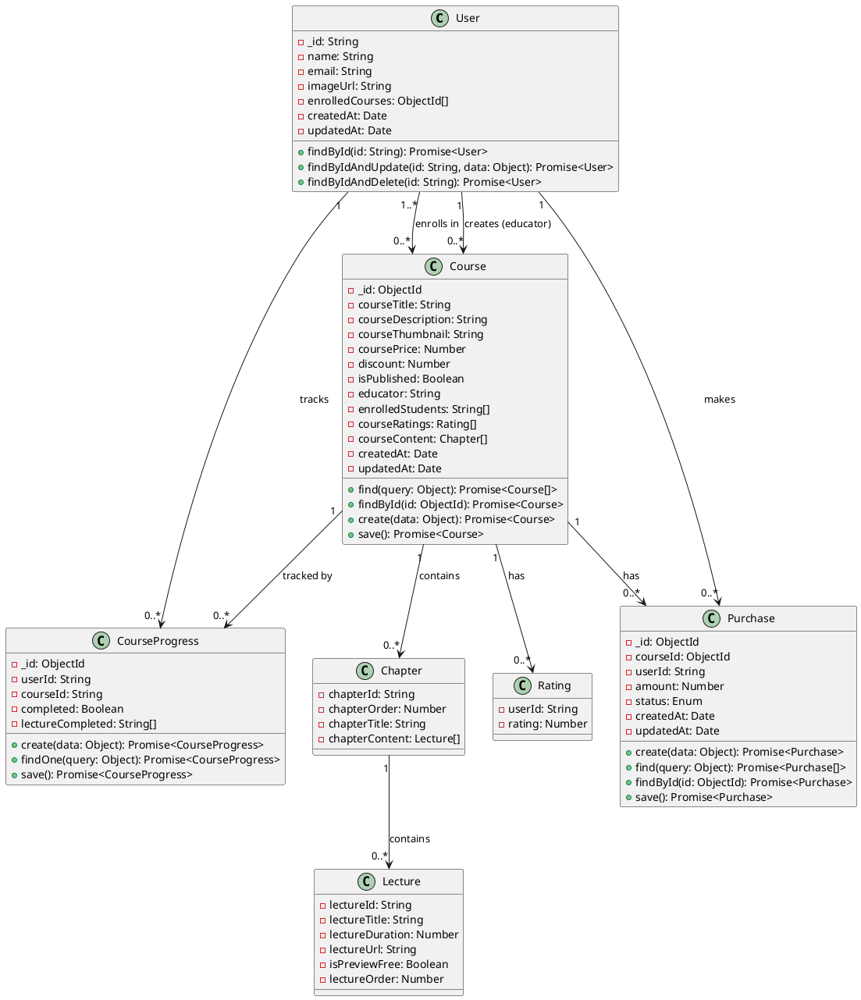
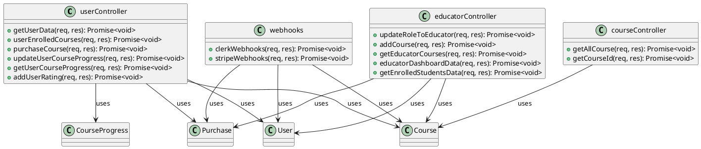
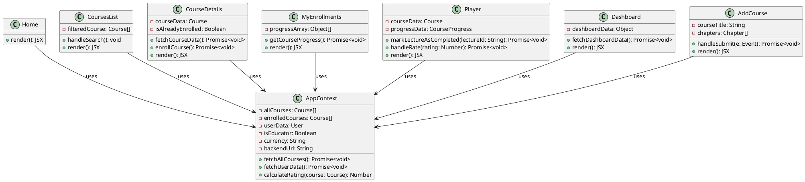
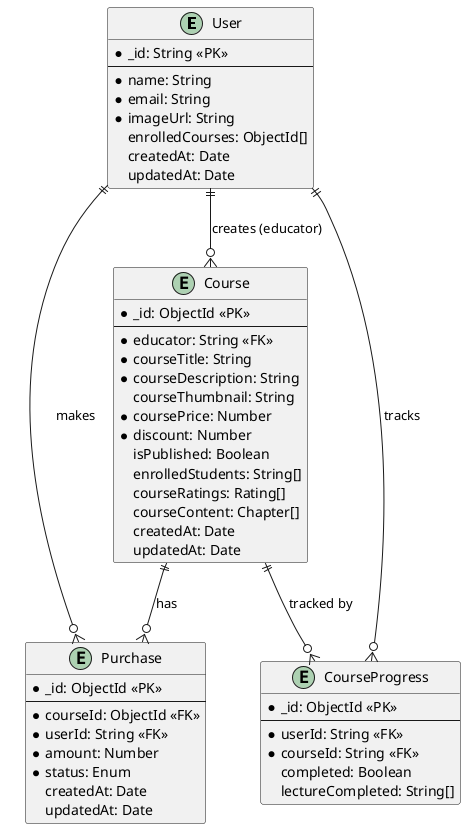

# 4. Structural Design – LMS Website

This document presents class diagrams, domain model, and Entity Relationship Diagram (ERD) for the LMS system.

---

## 4.1 Domain Model

The LMS domain consists of four core entities: **User**, **Course**, **Purchase**, and **CourseProgress**. These entities represent the main concepts and their relationships in the learning management system.

### 4.1.1 Core Domain Entities

```
┌─────────────────────────────────────────────────────────────────┐
│                         DOMAIN MODEL                             │
└─────────────────────────────────────────────────────────────────┘

┌──────────────┐
│    User      │
├──────────────┤
│ - _id: String│
│ - name: String│
│ - email: String│
│ - imageUrl: String│
│ - enrolledCourses: Course[]│
│ - createdAt: Date│
│ - updatedAt: Date│
└──────┬───────┘
       │
       │ 1..* (enrolls in)
       │
       ▼
┌──────────────┐
│   Course     │
├──────────────┤
│ - _id: ObjectId│
│ - courseTitle: String│
│ - courseDescription: String│
│ - courseThumbnail: String│
│ - coursePrice: Number│
│ - discount: Number│
│ - isPublished: Boolean│
│ - educator: User│
│ - enrolledStudents: User[]│
│ - courseRatings: Rating[]│
│ - courseContent: Chapter[]│
│ - createdAt: Date│
│ - updatedAt: Date│
└──────┬───────┘
       │
       │ 1 (created by)
       │
       └──────────┐
                  │
                  ▼
         ┌──────────────┐
         │   Educator   │
         │  (User with  │
         │   role =     │
         │   'educator')│
         └──────────────┘

┌──────────────┐
│   Purchase   │
├──────────────┤
│ - _id: ObjectId│
│ - courseId: Course│
│ - userId: User│
│ - amount: Number│
│ - status: Enum│
│   (pending,   │
│    completed, │
│    failed)    │
│ - createdAt: Date│
│ - updatedAt: Date│
└──────┬───────┘
       │
       │ links
       │
       └───┬──────────────┐
           │              │
           ▼              ▼
    ┌──────────────┐ ┌──────────────┐
    │    Course    │ │     User     │
    └──────────────┘ └──────────────┘

┌──────────────┐
│CourseProgress │
├──────────────┤
│ - _id: ObjectId│
│ - userId: String│
│ - courseId: String│
│ - completed: Boolean│
│ - lectureCompleted: String[]│
└──────┬───────┘
       │
       │ tracks
       │
       └───┬──────────────┐
           │              │
           ▼              ▼
    ┌──────────────┐ ┌──────────────┐
    │    Course    │ │     User     │
    └──────────────┘ └──────────────┘

┌──────────────┐
│   Chapter    │
├──────────────┤
│ - chapterId: String│
│ - chapterOrder: Number│
│ - chapterTitle: String│
│ - chapterContent: Lecture[]│
└──────┬───────┘
       │
       │ contains
       │
       ▼
┌──────────────┐
│   Lecture   │
├──────────────┤
│ - lectureId: String│
│ - lectureTitle: String│
│ - lectureDuration: Number│
│ - lectureUrl: String│
│ - isPreviewFree: Boolean│
│ - lectureOrder: Number│
└──────────────┘

┌──────────────┐
│   Rating     │
├──────────────┤
│ - userId: String│
│ - rating: Number│
│   (1-5)      │
└──────────────┘
```

### 4.1.2 Domain Relationships

| Relationship | Type | Description |
|--------------|------|-------------|
| User → Course | Many-to-Many | Users can enroll in multiple courses; courses can have multiple enrolled students |
| User → Course (Educator) | One-to-Many | An educator can create multiple courses |
| User → Purchase | One-to-Many | A user can make multiple purchases |
| Course → Purchase | One-to-Many | A course can have multiple purchase transactions |
| User → CourseProgress | One-to-Many | A user can have progress records for multiple courses |
| Course → CourseProgress | One-to-Many | A course can have progress records from multiple users |
| Course → Chapter | One-to-Many | A course contains multiple chapters |
| Chapter → Lecture | One-to-Many | A chapter contains multiple lectures |
| Course → Rating | One-to-Many | A course can have multiple ratings from different users |

---

## 4.2 Class Diagrams

### 4.2.1 Backend Model Classes

```
┌─────────────────────────────────────────────────────────────────┐
│                    BACKEND MODEL CLASSES                        │
└─────────────────────────────────────────────────────────────────┘

┌─────────────────────────────────────────────────────────────┐
│                         User                                 │
├─────────────────────────────────────────────────────────────┤
│ - _id: String                                                │
│ - name: String                                               │
│ - email: String                                              │
│ - imageUrl: String                                           │
│ - enrolledCourses: ObjectId[]                                │
│ - createdAt: Date                                            │
│ - updatedAt: Date                                            │
├─────────────────────────────────────────────────────────────┤
│ + findById(id: String): Promise<User>                       │
│ + findByIdAndUpdate(id: String, data: Object): Promise<User> │
│ + findByIdAndDelete(id: String): Promise<User>              │
└─────────────────────────────────────────────────────────────┘
                              │
                              │ 1..*
                              │
                              ▼
┌─────────────────────────────────────────────────────────────┐
│                        Course                                │
├─────────────────────────────────────────────────────────────┤
│ - _id: ObjectId                                             │
│ - courseTitle: String                                        │
│ - courseDescription: String                                 │
│ - courseThumbnail: String                                   │
│ - coursePrice: Number                                       │
│ - discount: Number                                          │
│ - isPublished: Boolean                                      │
│ - educator: String (ref: User)                              │
│ - enrolledStudents: String[] (ref: User)                     │
│ - courseRatings: Rating[]                                   │
│ - courseContent: Chapter[]                                   │
│ - createdAt: Date                                           │
│ - updatedAt: Date                                           │
├─────────────────────────────────────────────────────────────┤
│ + find(query: Object): Promise<Course[]>                    │
│ + findById(id: ObjectId): Promise<Course>                   │
│ + create(data: Object): Promise<Course>                      │
│ + findByIdAndUpdate(id: ObjectId, data: Object): Promise<Course>│
│ + save(): Promise<Course>                                   │
└─────────────────────────────────────────────────────────────┘
                              │
                              │ contains
                              │
                              ▼
┌─────────────────────────────────────────────────────────────┐
│                       Chapter                                │
├─────────────────────────────────────────────────────────────┤
│ - chapterId: String                                          │
│ - chapterOrder: Number                                       │
│ - chapterTitle: String                                       │
│ - chapterContent: Lecture[]                                 │
└─────────────────────────────────────────────────────────────┘
                              │
                              │ contains
                              │
                              ▼
┌─────────────────────────────────────────────────────────────┐
│                       Lecture                                │
├─────────────────────────────────────────────────────────────┤
│ - lectureId: String                                          │
│ - lectureTitle: String                                       │
│ - lectureDuration: Number                                   │
│ - lectureUrl: String                                         │
│ - isPreviewFree: Boolean                                    │
│ - lectureOrder: Number                                      │
└─────────────────────────────────────────────────────────────┘

┌─────────────────────────────────────────────────────────────┐
│                       Purchase                               │
├─────────────────────────────────────────────────────────────┤
│ - _id: ObjectId                                             │
│ - courseId: ObjectId (ref: Course)                          │
│ - userId: String (ref: User)                                │
│ - amount: Number                                            │
│ - status: Enum ['pending', 'completed', 'failed']          │
│ - createdAt: Date                                          │
│ - updatedAt: Date                                           │
├─────────────────────────────────────────────────────────────┤
│ + create(data: Object): Promise<Purchase>                   │
│ + find(query: Object): Promise<Purchase[]>                 │
│ + findById(id: ObjectId): Promise<Purchase>                 │
│ + findByIdAndUpdate(id: ObjectId, data: Object): Promise<Purchase>│
│ + save(): Promise<Purchase>                                 │
└─────────────────────────────────────────────────────────────┘

┌─────────────────────────────────────────────────────────────┐
│                    CourseProgress                            │
├─────────────────────────────────────────────────────────────┤
│ - _id: ObjectId                                             │
│ - userId: String                                            │
│ - courseId: String                                          │
│ - completed: Boolean                                        │
│ - lectureCompleted: String[]                                │
├─────────────────────────────────────────────────────────────┤
│ + create(data: Object): Promise<CourseProgress>            │
│ + findOne(query: Object): Promise<CourseProgress>           │
│ + save(): Promise<CourseProgress>                           │
└─────────────────────────────────────────────────────────────┘

┌─────────────────────────────────────────────────────────────┐
│                        Rating                                │
├─────────────────────────────────────────────────────────────┤
│ - userId: String                                            │
│ - rating: Number (1-5)                                      │
└─────────────────────────────────────────────────────────────┘
```

**PlantUML Syntax**:


---

### 4.2.2 Backend Controller Classes

```
┌─────────────────────────────────────────────────────────────┐
│                    userController                           │
├─────────────────────────────────────────────────────────────┤
│                                                              │
├─────────────────────────────────────────────────────────────┤
│ + getUserData(req, res): Promise<void>                      │
│ + userEnrolledCourses(req, res): Promise<void>              │
│ + purchaseCourse(req, res): Promise<void>                   │
│ + updateUserCourseProgress(req, res): Promise<void>         │
│ + getUserCourseProgress(req, res): Promise<void>            │
│ + addUserRating(req, res): Promise<void>                    │
└─────────────────────────────────────────────────────────────┘
                              │
                              │ uses
                              │
        ┌─────────────────────┼─────────────────────┐
        │                     │                     │
        ▼                     ▼                     ▼
┌──────────────┐      ┌──────────────┐      ┌──────────────┐
│     User     │      │    Course    │      │   Purchase   │
└──────────────┘      └──────────────┘      └──────────────┘

┌─────────────────────────────────────────────────────────────┐
│                   courseController                          │
├─────────────────────────────────────────────────────────────┤
│                                                              │
├─────────────────────────────────────────────────────────────┤
│ + getAllCourse(req, res): Promise<void>                     │
│ + getCourseId(req, res): Promise<void>                      │
└─────────────────────────────────────────────────────────────┘
                              │
                              │ uses
                              │
                              ▼
                    ┌──────────────┐
                    │    Course    │
                    └──────────────┘

┌─────────────────────────────────────────────────────────────┐
│                 educatorController                          │
├─────────────────────────────────────────────────────────────┤
│                                                              │
├─────────────────────────────────────────────────────────────┤
│ + updateRoleToEducator(req, res): Promise<void>            │
│ + addCourse(req, res): Promise<void>                        │
│ + getEducatorCourses(req, res): Promise<void>               │
│ + educatorDashboardData(req, res): Promise<void>           │
│ + getEnrolledStudentsData(req, res): Promise<void>         │
└─────────────────────────────────────────────────────────────┘
                              │
                              │ uses
                              │
        ┌─────────────────────┼─────────────────────┐
        │                     │                     │
        ▼                     ▼                     ▼
┌──────────────┐      ┌──────────────┐      ┌──────────────┐
│     User     │      │    Course    │      │   Purchase   │
└──────────────┘      └──────────────┘      └──────────────┘

┌─────────────────────────────────────────────────────────────┐
│                      webhooks                                │
├─────────────────────────────────────────────────────────────┤
│                                                              │
├─────────────────────────────────────────────────────────────┤
│ + clerkWebhooks(req, res): Promise<void>                   │
│ + stripeWebhooks(req, res): Promise<void>                  │
└─────────────────────────────────────────────────────────────┘
                              │
                              │ uses
                              │
        ┌─────────────────────┼─────────────────────┐
        │                     │                     │
        ▼                     ▼                     ▼
┌──────────────┐      ┌──────────────┐      ┌──────────────┐
│     User     │      │   Purchase   │      │    Course    │
└──────────────┘      └──────────────┘      └──────────────┘
```

**PlantUML Syntax**:


---

### 4.2.3 Frontend Component Classes (React)

```
┌─────────────────────────────────────────────────────────────┐
│                    Frontend Components                       │
└─────────────────────────────────────────────────────────────┘

┌─────────────────────────────────────────────────────────────┐
│                      AppContext                              │
├─────────────────────────────────────────────────────────────┤
│ - allCourses: Course[]                                       │
│ - enrolledCourses: Course[]                                  │
│ - userData: User                                             │
│ - isEducator: Boolean                                        │
│ - currency: String                                           │
│ - backendUrl: String                                         │
├─────────────────────────────────────────────────────────────┤
│ + fetchAllCourses(): Promise<void>                           │
│ + fetchUserData(): Promise<void>                             │
│ + fetchUserEnrolledCourses(): Promise<void>                 │
│ + calculateRating(course: Course): Number                    │
│ + calculateCourseDuration(course: Course): String            │
│ + calculateNoOfLectures(course: Course): Number              │
│ + calculateChapterTime(chapter: Chapter): String            │
└─────────────────────────────────────────────────────────────┘

┌─────────────────────────────────────────────────────────────┐
│                    Student Pages                             │
├─────────────────────────────────────────────────────────────┤
│                                                              │
│ Home                                                         │
│ - allCourses: Course[]                                       │
│ + render(): JSX                                              │
│                                                              │
│ CoursesList                                                   │
│ - filteredCourse: Course[]                                   │
│ - input: String                                              │
│ + handleSearch(): void                                       │
│ + render(): JSX                                              │
│                                                              │
│ CourseDetails                                                 │
│ - courseData: Course                                         │
│ - isAlreadyEnrolled: Boolean                                 │
│ - openSections: Object                                       │
│ + fetchCourseData(): Promise<void>                           │
│ + enrollCourse(): Promise<void>                              │
│ + toggleSection(index: Number): void                        │
│ + render(): JSX                                              │
│                                                              │
│ MyEnrollments                                                 │
│ - progressArray: Object[]                                    │
│ + getCourseProgress(): Promise<void>                         │
│ + render(): JSX                                              │
│                                                              │
│ Player                                                        │
│ - courseData: Course                                         │
│ - progressData: CourseProgress                                │
│ - playerData: Object                                         │
│ - initialRating: Number                                       │
│ + getCourseData(): void                                      │
│ + markLectureAsCompleted(lectureId: String): Promise<void>   │
│ + getCourseProgress(): Promise<void>                         │
│ + handleRate(rating: Number): Promise<void>                 │
│ + render(): JSX                                              │
└─────────────────────────────────────────────────────────────┘

┌─────────────────────────────────────────────────────────────┐
│                   Educator Pages                             │
├─────────────────────────────────────────────────────────────┤
│                                                              │
│ Dashboard                                                     │
│ - dashboardData: Object                                      │
│ + fetchDashboardData(): Promise<void>                        │
│ + render(): JSX                                              │
│                                                              │
│ AddCourse                                                      │
│ - courseTitle: String                                         │
│ - coursePrice: Number                                        │
│ - discount: Number                                           │
│ - image: File                                                │
│ - chapters: Chapter[]                                        │
│ - lectureDetails: Object                                      │
│ + handleChapter(action: String, chapterId: String): void     │
│ + handleLecture(action: String, chapterId: String, index: Number): void│
│ + addLecture(): void                                         │
│ + handleSubmit(e: Event): Promise<void>                      │
│ + render(): JSX                                              │
│                                                              │
│ MyCourses                                                     │
│ - courses: Course[]                                          │
│ + fetchEducatorCourses(): Promise<void>                      │
│ + render(): JSX                                              │
│                                                              │
│ StudentsEnrolled                                              │
│ - enrolledStudents: Object[]                                 │
│ + fetchEnrolledStudents(): Promise<void>                     │
│ + render(): JSX                                              │
└─────────────────────────────────────────────────────────────┘
```

**PlantUML Syntax**:


---

## 4.3 Entity Relationship Diagram (ERD)

### 4.3.1 Database Schema ERD

```
┌─────────────────────────────────────────────────────────────────┐
│                    ENTITY RELATIONSHIP DIAGRAM                   │
└─────────────────────────────────────────────────────────────────┘

┌─────────────────────────────────────────────────────────────┐
│                          USER                                 │
├─────────────────────────────────────────────────────────────┤
│ PK │ _id: String (Clerk ID)                                 │
│    │ name: String                                            │
│    │ email: String                                            │
│    │ imageUrl: String                                         │
│    │ enrolledCourses: ObjectId[] (FK → Course._id)           │
│    │ createdAt: Date                                          │
│    │ updatedAt: Date                                          │
└────┴─────────────────────────────────────────────────────────┘
       │
       │ 1
       │
       │ creates (if role = 'educator')
       │
       │ 1..*
       ▼
┌─────────────────────────────────────────────────────────────┐
│                         COURSE                                │
├─────────────────────────────────────────────────────────────┤
│ PK │ _id: ObjectId                                           │
│ FK │ educator: String (FK → User._id)                       │
│    │ courseTitle: String                                      │
│    │ courseDescription: String (HTML)                        │
│    │ courseThumbnail: String (Cloudinary URL)                │
│    │ coursePrice: Number                                      │
│    │ discount: Number (0-100)                                │
│    │ isPublished: Boolean                                     │
│    │ enrolledStudents: String[] (FK → User._id)              │
│    │ courseRatings: [                                        │
│    │   {userId: String (FK → User._id),                      │
│    │    rating: Number (1-5)}                                │
│    │ ]                                                        │
│    │ courseContent: [                                        │
│    │   {chapterId: String,                                   │
│    │    chapterOrder: Number,                                │
│    │    chapterTitle: String,                                │
│    │    chapterContent: [                                    │
│    │      {lectureId: String,                                │
│    │       lectureTitle: String,                             │
│    │       lectureDuration: Number,                         │
│    │       lectureUrl: String,                              │
│    │       isPreviewFree: Boolean,                          │
│    │       lectureOrder: Number}                            │
│    │    ]                                                    │
│    │   }                                                     │
│    │ ]                                                        │
│    │ createdAt: Date                                          │
│    │ updatedAt: Date                                          │
└────┴─────────────────────────────────────────────────────────┘
       │
       │ 1
       │
       │ enrolled in (via Purchase)
       │
       │ 1..*
       ▼
┌─────────────────────────────────────────────────────────────┐
│                        PURCHASE                               │
├─────────────────────────────────────────────────────────────┤
│ PK │ _id: ObjectId                                           │
│ FK │ courseId: ObjectId (FK → Course._id)                    │
│ FK │ userId: String (FK → User._id)                          │
│    │ amount: Number                                           │
│    │ status: Enum ['pending', 'completed', 'failed']         │
│    │ createdAt: Date                                          │
│    │ updatedAt: Date                                          │
└────┴─────────────────────────────────────────────────────────┘

┌─────────────────────────────────────────────────────────────┐
│                     COURSE_PROGRESS                          │
├─────────────────────────────────────────────────────────────┤
│ PK │ _id: ObjectId                                           │
│ FK │ userId: String (FK → User._id)                          │
│ FK │ courseId: String (FK → Course._id)                      │
│    │ completed: Boolean                                       │
│    │ lectureCompleted: String[] (lectureIds)                  │
└────┴─────────────────────────────────────────────────────────┘
       │
       │ tracks
       │
       └───────────────────────────────────────────────────────┐
                                                                 │
                                                                 │
                    RELATIONSHIP SUMMARY                         │
                                                                 │
  User ──────<enrolls in>────── Course (Many-to-Many via Purchase)│
  User ──────<creates>────────── Course (One-to-Many, if educator) │
  User ──────<makes>──────────── Purchase (One-to-Many)           │
  Course ────<has>────────────── Purchase (One-to-Many)          │
  User ──────<tracks>─────────── CourseProgress (One-to-Many)    │
  Course ────<tracked by>─────── CourseProgress (One-to-Many)    │
```

### 4.3.2 ERD with Cardinality

```
┌──────────────┐                    ┌──────────────┐
│     USER     │                    │    COURSE    │
├──────────────┤                    ├──────────────┤
│ PK _id       │                    │ PK _id       │
│    name      │                    │ FK educator  │
│    email     │                    │    title     │
│    imageUrl  │                    │    price     │
│    enrolled  │                    │    ...       │
│    Courses[] │                    │              │
└──────┬───────┘                    └──────┬───────┘
       │                                   │
       │                                   │
       │ 1..*                              │ 1
       │                                   │
       │ creates (if educator)            │
       │                                   │
       │                                   │
       │                                   │
       │ 1..*                              │ 1..*
       │                                   │
       │ enrolls in                        │
       │                                   │
       │                                   │
       └───────────┐             ┌────────┘
                   │             │
                   │             │
                   ▼             ▼
            ┌──────────────┐
            │   PURCHASE   │
            ├──────────────┤
            │ PK _id       │
            │ FK courseId  │
            │ FK userId    │
            │    amount    │
            │    status    │
            └──────────────┘
                   │
                   │
                   │ 1..*
                   │
                   │
                   ▼
            ┌──────────────┐
            │COURSE_PROGRESS│
            ├──────────────┤
            │ PK _id       │
            │ FK userId    │
            │ FK courseId  │
            │ completed    │
            │ lectureCompleted[]│
            └──────────────┘
```

**Cardinality Notation**:
- **User → Course (Educator)**: 1 to Many (1:N)
- **User → Course (Enrollment)**: Many to Many (M:N) via Purchase
- **User → Purchase**: 1 to Many (1:N)
- **Course → Purchase**: 1 to Many (1:N)
- **User → CourseProgress**: 1 to Many (1:N)
- **Course → CourseProgress**: 1 to Many (1:N)

**PlantUML Syntax**:


---

## 4.4 Data Dictionary

### 4.4.1 User Entity

| Attribute | Type | Constraints | Description |
|-----------|------|-------------|-------------|
| _id | String | PK, Required | Clerk user ID (primary key) |
| name | String | Required | User's full name |
| email | String | Required, Unique | User's email address |
| imageUrl | String | Required | Profile image URL from Clerk |
| enrolledCourses | ObjectId[] | Array, FK → Course._id | List of course IDs user is enrolled in |
| createdAt | Date | Auto-generated | Timestamp of user creation |
| updatedAt | Date | Auto-generated | Timestamp of last update |

### 4.4.2 Course Entity

| Attribute | Type | Constraints | Description |
|-----------|------|-------------|-------------|
| _id | ObjectId | PK, Auto-generated | Course unique identifier |
| educator | String | FK → User._id, Required | ID of educator who created the course |
| courseTitle | String | Required | Title of the course |
| courseDescription | String | Required | HTML description of the course |
| courseThumbnail | String | Optional | Cloudinary URL of course thumbnail |
| coursePrice | Number | Required, >= 0 | Original price of the course |
| discount | Number | Required, 0-100 | Discount percentage (0-100) |
| isPublished | Boolean | Default: true | Whether course is visible in catalog |
| enrolledStudents | String[] | Array, FK → User._id | List of user IDs enrolled in course |
| courseRatings | Rating[] | Array | Array of rating objects {userId, rating} |
| courseContent | Chapter[] | Array | Nested structure: chapters → lectures |
| createdAt | Date | Auto-generated | Timestamp of course creation |
| updatedAt | Date | Auto-generated | Timestamp of last update |

### 4.4.3 Purchase Entity

| Attribute | Type | Constraints | Description |
|-----------|------|-------------|-------------|
| _id | ObjectId | PK, Auto-generated | Purchase unique identifier |
| courseId | ObjectId | FK → Course._id, Required | ID of course being purchased |
| userId | String | FK → User._id, Required | ID of user making purchase |
| amount | Number | Required, > 0 | Final amount after discount |
| status | Enum | Default: 'pending', Values: ['pending', 'completed', 'failed'] | Purchase transaction status |
| createdAt | Date | Auto-generated | Timestamp of purchase creation |
| updatedAt | Date | Auto-generated | Timestamp of last update |

### 4.4.4 CourseProgress Entity

| Attribute | Type | Constraints | Description |
|-----------|------|-------------|-------------|
| _id | ObjectId | PK, Auto-generated | Progress record unique identifier |
| userId | String | FK → User._id, Required | ID of user tracking progress |
| courseId | String | FK → Course._id, Required | ID of course being tracked |
| completed | Boolean | Default: false | Whether entire course is completed |
| lectureCompleted | String[] | Array | List of lecture IDs marked as completed |

### 4.4.5 Chapter (Embedded in Course)

| Attribute | Type | Constraints | Description |
|-----------|------|-------------|-------------|
| chapterId | String | Required | Unique identifier for chapter |
| chapterOrder | Number | Required | Order of chapter in course |
| chapterTitle | String | Required | Title of the chapter |
| chapterContent | Lecture[] | Array | Array of lectures in chapter |

### 4.4.6 Lecture (Embedded in Chapter)

| Attribute | Type | Constraints | Description |
|-----------|------|-------------|-------------|
| lectureId | String | Required | Unique identifier for lecture |
| lectureTitle | String | Required | Title of the lecture |
| lectureDuration | Number | Required, >= 0 | Duration in minutes |
| lectureUrl | String | Required | URL to lecture video (typically YouTube) |
| isPreviewFree | Boolean | Required | Whether lecture is free to preview |
| lectureOrder | Number | Required | Order of lecture in chapter |

### 4.4.7 Rating (Embedded in Course)

| Attribute | Type | Constraints | Description |
|-----------|------|-------------|-------------|
| userId | String | FK → User._id, Required | ID of user who rated |
| rating | Number | Required, 1-5 | Rating value (1 to 5 stars) |

---

## 4.5 Indexes and Constraints

### 4.5.1 Recommended Indexes

| Collection | Field(s) | Type | Purpose |
|------------|----------|------|---------|
| User | _id | Primary Key | Fast user lookup |
| User | email | Unique Index | Prevent duplicate emails |
| Course | _id | Primary Key | Fast course lookup |
| Course | educator | Index | Fast query for educator's courses |
| Course | isPublished | Index | Fast filtering of published courses |
| Purchase | _id | Primary Key | Fast purchase lookup |
| Purchase | userId | Index | Fast query for user's purchases |
| Purchase | courseId | Index | Fast query for course purchases |
| Purchase | status | Index | Fast filtering by status |
| CourseProgress | userId | Index | Fast query for user's progress |
| CourseProgress | courseId | Index | Fast query for course progress |
| CourseProgress | (userId, courseId) | Compound Index | Fast lookup of specific user-course progress |

### 4.5.2 Constraints

| Constraint | Entity | Field | Rule |
|------------|--------|-------|------|
| Primary Key | All | _id | Unique identifier |
| Foreign Key | Course | educator | Must reference existing User._id |
| Foreign Key | Purchase | courseId | Must reference existing Course._id |
| Foreign Key | Purchase | userId | Must reference existing User._id |
| Check | Course | discount | Must be between 0 and 100 |
| Check | Course | coursePrice | Must be >= 0 |
| Check | Rating | rating | Must be between 1 and 5 |
| Enum | Purchase | status | Must be 'pending', 'completed', or 'failed' |
| Required | User | name, email, imageUrl | Cannot be null |
| Required | Course | courseTitle, courseDescription, coursePrice, discount, educator | Cannot be null |
| Required | Purchase | courseId, userId, amount | Cannot be null |
| Required | CourseProgress | userId, courseId | Cannot be null |

---

## 4.6 Summary

This structural design document presents:

1. **Domain Model**: Core entities (User, Course, Purchase, CourseProgress) and their relationships
2. **Class Diagrams**: 
   - Backend model classes (Mongoose schemas)
   - Backend controller classes
   - Frontend React component classes
3. **ERD**: Entity Relationship Diagram showing database schema with primary keys, foreign keys, and cardinalities
4. **Data Dictionary**: Detailed attribute definitions with types, constraints, and descriptions
5. **Indexes and Constraints**: Recommended database optimizations and data integrity rules

The structure follows a **document-based NoSQL design** (MongoDB) with embedded sub-documents (chapters, lectures, ratings) and references for relationships (enrolledCourses, enrolledStudents, educator). This design balances flexibility with query performance through appropriate indexing.
